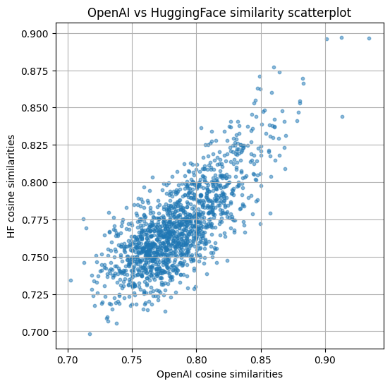

# Simple Retrieval Augmented Generation (RAG) from Scratch

This small project shows how to build a basic Question-Answering chatbot based on the [Retrieval-Augmented Generation (RAG)](https://en.wikipedia.org/wiki/Retrieval-augmented_generation) pattern from scratch.

RAG consists in 

- retrieving relevant documents related to the user **query** 
- and feeding them to a generative model in the context along with the query, while we instruct it to provide the answer using the provided documents/context.

Therefore, we avoid needing to fine-tune the generative model with our documents.
This is specially well suited when we want to extend the model's *memory* with recent and continuously changing documents, aka. the *knowledge base*.

In order to show how the approach works,

- I use the **large language model (LLM)** [`gpt-3.5-turbo-instruct`](https://platform.openai.com/docs/models/gpt-3.5-turbo?snapshot=gpt-3.5-turbo-instruct) from OpenAI
- and a **dataset** or set of **queried documents** built from the Wikipedia article [2024 Events in Spain](https://en.wikipedia.org/wiki/2024_in_Spain) (54 events in total).

The [`gpt-3.5-turbo-instruct`](https://platform.openai.com/docs/models/gpt-3.5-turbo?snapshot=gpt-3.5-turbo-instruct) model

- is a Legacy GPT model for cheaper chat and non-chat tasks,
- has a context window of `4,096` tokens,
- and has a **knowledge cutoff as of Sep 01, 2021**.

Therefore, we can be sure that none of the 2024 events in Spain were used for during the model training. Therefore,

- if we ask the model a question about the dataset, it should hallucinate and/or fail to answer properly;
- but if we use the RAG pattern, it should be able to build and use a relevant context that facilitates a correct answer.

One can say that RAG systems have two major pipelines, and each of them gets a section here:

- [Dataset Indexing Pipeline](#dataset-indexing): the documents that conform the *knowledge base* are preprocessed and transformed into structures that enable fast and easy retrieval of relevant documents. This pipeline is run offline, i.e., as a prior *training* or *preparation* step.
- [Query Pipeline](#query-pipeline): here is where the RAG pattern is run, i.e., the user poses a question, relevant documents are retrieved and inserted into the query prompt and an answer is generated by the LLM.

## Setup

Create an OpenAI account and get an API key; we should save the key in our local and uncommitted `.env`.

Then, create a python environment and install the dependencies:

```bash
# Create the necessary Python environment
conda env create -f conda.yaml
conda activate gennai

# Compile and install all dependencies
pip-compile requirements.in
pip-sync requirements.txt

# If we need a new dependency,
# add it to requirements.in 
# And then:
pip-compile requirements.in
pip-sync requirements.txt
```

Finally, open the notebook where everything is implemented: [`qa_rag.ipynb`](./qa_rag.ipynb).

## Dataset Indexing

The dataset or queried documents are scrapped from the Wikipedia article [2024 Events in Spain](https://en.wikipedia.org/wiki/2024_in_Spain) using `BeautifulSoup`.

The main parsing function is `get_wikipedia_events()`, which returns a list of dictionaries; each dictionary is an event, which contains: 

- `month (str)`: The month of the event.
- `date_text (str)`: The raw date text from the page.
- `date (datetime.date)`: The parsed start date of the event.
- `date_end (Optional[datetime.date])`: The parsed end date if it's a date range, else `None`.
- `event (str)`: The cleaned event description.
- `refs (list[str])`: List of reference IDs from the page.
- `reference_urls (list[str])`: List of URLs for references.
- `reference_entities (list[str])`: List of entities associated with the references.

Then, the the content in the reference URLs is fetched in `get_event_reference_contents()`, which updated the dictionaries with the field `reference_content`.

Additionally, the field `text` is also added in the same function; `text` which is the concatenation of the `date + event + reference_content` fields, i.e., a detailed description of the event.

### Vector Representations

In order to be able to retrieve relevant documents relative to our question/query, we need to 

- preprocess and split our documents properly
- and represent and index our data efficiently.

In our example, as explained, preprocessing and splitting is done at event level: the article is parsed and each event text and metadata (e.g., date, references) are stored in separate documents.

Document/Text representation for fast relevant retrieval is approached in two ways:

- Semantic embeddings: document texts are converted into semantic embeddings, i.e., multi-dimensional dense vectors which point in similar directions if the text have a similar meaning. Embeddings have a fixed dimensionality, defined by the model which generated them. Two embedding models are used:
  - [`intfloat/e5-large-v2`](https://huggingface.co/intfloat/e5-large-v2), from HuggingFace, downloaded and used locally.
  - [`text-embedding-ada-002`](https://platform.openai.com/docs/models/text-embedding-ada-002), from OpenAI, accessed by the API.
- TFIDF indices: *term frequency and inverse document frequency* is technique which sparsely represents the documents by assigning frequency weights to their tokens/terms in relation to their occurrences in the document and in the complete document set. Each token/term in the complete set represents a dimension in the TFIDF vectors.

The combination of several retrieved document sets is also exemplarily shown by implementing *reciprocal rank fusion*.

In addition to the *functional* implementation style followed in the notebook, the class `DataRetriever` is also provided, which compiles the most important functions and transformed data (the indices). `DataRetriever` objects behave and can be used homogeneously independently of the approaches they contain under the hood.

In a regular situation (i.e., not for teaching purposes), it is encouraged to program everything from scratch using the OOP paradigm.

## Query Pipeline

Finally, we implement here `ask_question()`, which integrates all functions and structures defined so far for the answer generation:

- `DataRetriever` objects, which contain:
  - The generated vector indices
  - Transformation and search functions for retrieval
- Retrieval fusion
- Prompt creation
- Call to the response generation via the `completions` API from OpenAI

The same function appends to the generated answer the reference URLs of the selected documents.

## Examples and Comparisons

Finally, different aspects of the implemented system are briefly benchmarked:

1. Which is the difference between using the base model [`gpt-3.5-turbo-instruct`](https://platform.openai.com/docs/models/gpt-3.5-turbo?snapshot=gpt-3.5-turbo-instruct) and the same base model with a context containing query-relevant documents?
2. Which is the difference between the two embedding models used?
3. Which are the differences between the implemented retrievers?

### Plain Model vs. RAG-Based Model

The RAG pipeline seems to find the correct answer when the *knowledge base* is used to enrich the context:

```python
q1 = "When was the first election in Spain in the year 2024 and where was it?"
q2 = "How much money did Spain promise to provide to the Ukraine in 2024?"
for q in [q1, q2]:
    print(ask_question(q1, docs, retrievers, use_knowledge_base=True))
```

Response to `q1`:

> The first election in Spain in the year 2024 was on Sunday, 18 February in Galicia.
>
> Reference(s):  
> https://en.wikipedia.org/wiki/2024_Galician_regional_election
> https://en.wikipedia.org/wiki/2024_European_Parliament_election

Response to `q2`:

> 1 billion euros ($1.1 billion)
> 
> Reference(s):  
> https://www.aljazeera.com/news/2024/5/27/spain-pledges-1-billion-euros-of-military-aid-to-ukraine-in-2024
> https://www.telegraph.co.uk/world-news/2024/06/11/torrential-rain-floods-majorca-airport-spain/

And, as expected, if no knowledge base is allowed, the model has not enough information to answer without hallucinating:

Response to `q1`:

> There is no way to accurately answer this question as it is impossible to predict the future and the date and location of the first election in Spain in 2024. Elections in Spain typically occur every four years, so the next election in 2024 would likely take place in late spring or early summer. The location of the election would depend on the specific election and the political climate at the time.


Response to `q2`:

> There is no information available about Spain promising to provide money to Ukraine in 2024.

### Differences between Embeddings

Selecting the embeddings we want to use depends on several questions:

- Are we going to compute them locally or via an API?
- How much does it cost to compute them (per 1,000 tokens)?
- How well do they represent the underlying texts?
- Which is the maximum text length per embedding?
- ...

In any case, the first step for the selection consists comparing in them it terms of similarity; to that end, cosine similarities between the 54 document embeddings are computed for each embedding model. Then, the correlation between those model similarities are computed.

Two correlations are considered:

- Pearson: Measures linear correlation between two variables. *"Do the values lie on a straight line?"*
- Spearman: Measures rank correlation (monotonic relationships). *"Do the values move in the same order (up or down)?"*

All in all, we can see a correlation above 70%: `Pearson 0.765, Spearman 0.714`.



### Differences in Retrieval

We should also consider how good our retrieval works. Among other metrics, **recall** is often used to evaluate retrievers, which measures the question *is the answer in the returned top-k documents?*.

However, we need an annotated dataset to measure recall. Instead, I will compute the **Jaccard** similarity between the top-k documents retrieved sets.
The Jaccard similarity between sets is defined as

$$
J(docs_1, docs_2) = \frac{|docs_1 \cap docs_2|}{|docs_1 \cup docs_2|}
$$

It ranges in `[0,1]`, where:

- `J = 1.0` similarity (0 distance): the sets are identical
- `J = 0.0` similarity (1 distance): no overlap

Jaccard is an inexpensive alternative to measure the differences between retrievers, specially if we have a reference retriever we know is good enough.

After a brief explorative inspection, the OpenAI embeddings seem to lead to good set of retrieved documents.
Using the OpenAI embeddings as reference method, the Jaccard similarity of the HF and TFIDF retrievers for the top 5 documents is:

- OpenAI vs TFIDF: 0.279
- OpenAI vs HF: 0.499